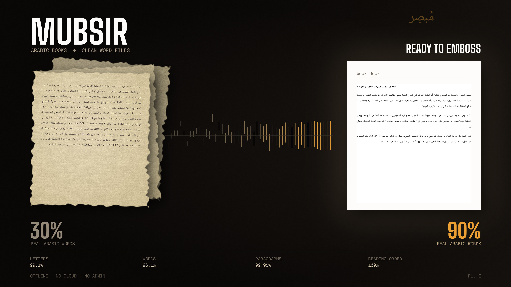

<div align="center">

# مُبصِر · mubsir

### Arabic books → one clean Word file, ready for a Braille embosser

**99.1% of letters right · 96.1% of words exactly right · 99.95% of paragraphs · 100% reading order**

*Offline · no cloud · no account · no admin rights*



</div>

---

## Use it

```bash
python run.py              # opens a page — drag your book in
python run.py book.pdf     # or straight to output/book.docx
```

The first run installs everything into your home folder. Nothing needs an
administrator.

## Built for Braille

Embossers are unforgiving, so the output is shaped for them:

- **Real paragraphs.** A soft line wrap and a paragraph break are different
  things, and confusing them is what ruins an emboss. It is the number this tool
  optimises hardest: **99.95%** correct on a text layer, 95.5% on scans.
- **No stray line breaks.** The `.docx` contains **zero** manual line breaks —
  Word does the wrapping. A space is a Braille cell; a paragraph mark ends a
  block; a newline inside a paragraph becomes a hard line ending the reader
  cannot tell from a real one. Tabs, double spaces, no-break spaces, zero-width
  and direction-control characters are all stripped by construction.
- **Semantic styles**, not visual ones — Heading, Normal, List. Braille is
  linear; where something sat on the page means nothing.
- **Page furniture dropped.** Running heads and page numbers are noise.

⚠️ **Check it before you emboss.** About 4 words in 100 need a look on a scan.
Uncertain paragraphs are **highlighted yellow** in the Word file and a review
report ranks them by risk — the aim is to make checking fast, not to skip it.
Paper and machine time cost too much to trust any tool blindly.

## Accuracy

`python run.py --demo` reproduces every number below against ground truth that
ships with the repository.

| Input | Letters right | Words right | Paragraphs | Reading order |
|---|---|---|---|---|
| PDF with a good text layer | 100% | 100% | **99.95%** | 100% |
| PDF with a broken text layer | 90% real Arabic words | — | **99.95%** | 100% |
| Scan, single column | **99.1%** | **96.1%** | 95.5% | 100% |
| Scan, two columns | 92.9% | 87.6% | 87.8% | 99.4% |

Against the alternatives, same pages, same machine:

| Tool | Characters wrong | Words wrong |
|---|---|---|
| Copying text out of the PDF | ~70% of words | — |
| EasyOCR (Arabic) | 42.6% | 61.7% |
| PaddleOCR (Arabic) | 6.9% | 30.8% |
| Tesseract 5 alone | 4.5% | 10.4% |
| **mubsir** | **1.2%** | **3.9%** |

## Why it beats them

**An Arabic text layer can be wrong while looking perfect.** A real 209-page
book written in Word renders as `ليصبح التفوق والموهبة` and extracts as
`ليربح التفػؽ كالسػـبة`. Every wrong character is still a valid Arabic letter, so
the usual corruption check scores that page **0.0% corrupt** while it is
unreadable — only a dictionary catches it. The glyphs were never wrong, only
their Unicode labels, so mubsir reads the raw glyph IDs back through the font
inside the PDF: **30% → 90% real Arabic words, no OCR involved.**

**No single OCR engine does both halves.** One detector finds every line,
including the short last line of a paragraph — the strongest signal that a
paragraph ended. Tesseract reads Arabic three times more accurately but silently
drops exactly those lines. Together they cover each other.

**English inside Arabic books now reads.** Tesseract's Arabic model has *no
Latin characters in its alphabet* — 85 symbols, not one of them `a`. It could
not output "Psychology" even in principle. Each line is now read twice and
reconciled word by word on the confidence margin.

## Does it use AI?

Nothing generative touches a single word, so it cannot invent one. There is
machine learning in exactly one place — deciding whether a line break is a
paragraph — and it is **1.1 KB of weights**, not a language model. Two local
LLMs were tried on that decision first and both scored at **chance**.

## Speed

An Intel i3 with 8 GB and no graphics card: **~0.5 s** per page with a text
layer, **6–9 s** per scanned page. A 209-page book takes about **104 seconds**.

## What's here

```
run.py             install and run
mubsir/            the pipeline, its tests, demo pages, models
hero.jpg           the picture above
requirements.txt   dependencies
```

Method, every benchmark, and an honest list of what still fails:
**[mubsir/RESEARCH.md](mubsir/RESEARCH.md)**

## Known limits

- Two-column scans are the weak spot: 7.1% of characters wrong against 1.2%.
- The Arabic comma `،` is 31% of all character errors — the recogniser cannot
  reliably tell it from a full stop.
- Printed text only. No handwriting.

## Licence

Apache-2.0. Bundled models keep their own licences — see
`mubsir/models/lexicon/SOURCE.md`.
