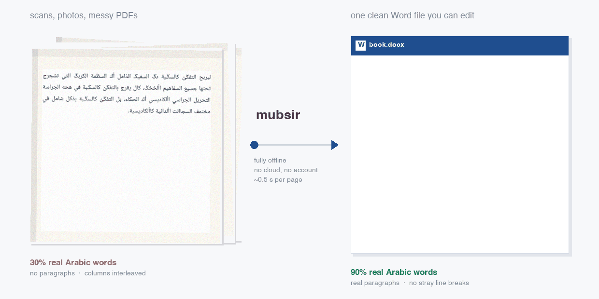

<div align="center">

# مُبصِر · mubsir

### Messy Arabic pages in. One clean Word file out.

**99.1% of characters right · 96.1% of words exactly right · 99.95% of paragraphs · 100% reading order**

*Fully offline · no cloud · no account · no admin rights*



</div>

---

## What it does

Drop in a PDF, a scan, or photos of pages. Get back **one `.docx`** — real
Arabic, real paragraphs, right-to-left, with Heading / Normal / List styles.
Open it in Word, edit it, save it, hand it to whoever embosses the Braille.

It also writes plain text, a review PDF for proofreading, and a short report
listing the few paragraphs worth a second look.

## Run it

```bash
./setup.sh                 # setup.bat on Windows. Once. No admin needed.
python demo/run_demo.py    # measures itself against ground truth that ships here
```

Then your own file:

```bash
python -m mubsir book.pdf -o output      # → output/book.docx
python -m mubsir.webui                   # or a browser page, drag files in
```

---

## Accuracy

Measured, not claimed. `python demo/run_demo.py` reproduces these against the
ground truth in `demo/pages/*.gold.json`.

| Input | Characters right | Words right | Paragraphs right | Reading order |
|---|---|---|---|---|
| PDF with a good text layer | **100%** | **100%** | **99.95%** | **100%** |
| PDF with a broken text layer | 90% of words are real Arabic | — | **99.95%** | **100%** |
| Scanned page, single column | **98.8%** | **96.1%** | **95.5%** | **100%** |
| Scanned page, two columns | 92.9% | 87.6% | 87.8% | 99.4% |

Splitting letters from punctuation says more than one number can:

| Scanned, single column | Characters right | Words right |
|---|---|---|
| everything | 98.8% | 96.1% |
| ignoring punctuation | 99.0% | **97.5%** |
| **letters only** | **99.1%** | — |

**Over 99 Arabic letters in 100 are correct.** Most of what remains is
punctuation — chiefly the Arabic comma `،`, which the recogniser confuses with
a full stop because both are small marks on the baseline.

### Against the alternatives

Same pages, same machine, measured rather than quoted:

| Tool | Characters wrong | Words wrong | Seconds/page |
|---|---|---|---|
| Copying text straight out of the PDF | ~70% of words | — | instant |
| EasyOCR (Arabic) | 42.6% | 61.7% | 50.0 |
| PaddleOCR PP-OCRv4 (Arabic) | 6.9% | 30.8% | 3.9 |
| Tesseract 5 alone | 4.5% | 10.4% | 2.0 |
| **mubsir** | **1.2%** | **3.9%** | 6–9 |

---

## The three things that make it work

**1. An Arabic text layer can be wrong while looking perfect.** A real 209-page
book written in Word 2010 renders as `ليصبح التفوق والموهبة` and extracts as
`ليربح التفػؽ كالسػـبة`. Every wrong character is *still a valid Arabic letter*,
so the usual corruption check scores the page **0.0% corrupt** while it is
unreadable — only a dictionary catches it. The glyphs were never wrong, only
their Unicode labels, so mubsir reads the raw glyph IDs back through the font
embedded in the PDF: **30% → 90% real Arabic words, 209 pages in 104 seconds,
no OCR at all.**

**2. No single OCR engine does both halves of the job.** DBNet finds every line
including the short last line of a paragraph — the strongest clue a paragraph
ended. Tesseract reads Arabic ~3× more accurately but silently *drops* those
lines under every one of its page-segmentation modes. Used together: **CER 4.8×
better, WER 7.5× better** than either alone.

**3. Tesseract's Arabic model has no Latin characters at all.** 85 symbols: 48
Arabic, 24 punctuation, 10 digits. It cannot emit "Psychology" even in
principle, so every English word in an Arabic book came back as noise. Each line
is now read twice and reconciled per word on the confidence margin, which
recovered the Latin *and* lowered overall error.

---

## Spacing and returns

For an embosser a **space** and a **paragraph mark** are different instructions.
A space is a Braille cell; a paragraph mark ends a block; a stray line break
inside a paragraph becomes a hard line ending the reader cannot tell from a real
one. So it is guaranteed by construction, not checked afterwards:

- newline inside a paragraph → **one space** (it was a soft wrap all along)
- tabs and runs of spaces → one space
- no-break / thin / hair / figure / line-separator spaces → **a plain space**
- zero-width and bidi control characters → **deleted**
- leading and trailing spaces stripped

**The file contains no manual line breaks at all** — Word does the wrapping.
Check any finished file yourself:

```bash
python tests/audit_docx.py output/book.docx
```

```
[ ok ] hard_line_breaks           0
[ ok ] newline_inside_paragraph   0
[ ok ] tab_runs                   0
[ ok ] double_space               0
[ ok ] leading_or_trailing_space  0
VERDICT: clean for embossing
```

---

## Does it use AI?

**Nothing generative touches a single word**, so it cannot invent a term that
was never on the page. Every character comes from the PDF's own font or the OCR
engine.

There is machine learning in exactly one place: deciding whether a line break is
a soft wrap or a real paragraph. A local language model was tried first and
**failed at chance** — both a 1.5B and a 3B model answered the same word to
every question (`NEW` to all of them in English, `نعم` to all of them in Arabic),
following the framing rather than the evidence, because the evidence is
geometric and a language model handed two text snippets cannot see it.

| | size | per decision | accuracy |
|---|---|---|---|
| local LLM (`qwen2.5:1.5b`) | 986 MB | 1.6 s | chance |
| local LLM (`qwen2.5vl:3b`) | 3.2 GB | 4.6 s | chance |
| **what shipped** | **1.1 KB** | **microseconds** | **99.1%** |

1.1 KB of logistic-regression weights over eleven geometric features, trained on
3,379 labelled boundaries, validated **leave-one-style-out**. It lifts
scanned-page paragraph accuracy **91.4% → 95.5%**.

A full noisy-channel text corrector was also built and trained on 1,616 of this
pipeline's real errors — then **rejected, because it made the text worse** (it
broke 16 correct words for every 5 it fixed). That is the known result: post-OCR
correction pays between about 2% and 10% character error, and this pipeline is
at 1.2%. Only corrections damaging **under 0.5% of already-correct words** ship.

---

## How heavy is it?

Built for the machines the work happens on: **old Windows PCs, 8 GB RAM, no
graphics card, no admin rights.** Numbers from an Intel i3-8100.

| | |
|---|---|
| Install | ~350 MB dependencies + ~55 MB models |
| Memory while running | under 1 GB |
| Graphics card | not used |
| Network | once, during setup |
| Born-digital page | ~0.5 s |
| Scanned page | 6–9 s |
| A 209-page book | **104 seconds** |

Python, Tesseract and the models all install inside your home folder.

---

## What you get

| File | For |
|---|---|
| `book.docx` | **the main output** — edit in Word, hand on for embossing |
| `book.txt` | plain text, one paragraph per block |
| `book.review.pdf` | proofreading: numbered paragraphs, page refs, doubts shaded |
| `book.review.html` | the few paragraphs worth checking, ranked by risk |

Uncertain paragraphs are **highlighted yellow** in the Word file. The point is
not to be perfect — it is to make the human review fast and targeted.

## How it works

```
PDF, scans or photos
  │
  ├─ 1. Is the text layer trustworthy?
  │     Not "does one exist" — a broken Arabic font maps every letter to a
  │     different valid Arabic letter, so it looks fine and reads as nonsense.
  │     The test is: are these real words?
  │        trustworthy → use it
  │        broken      → rebuild from the embedded font (exact, no OCR)
  │        none        → OCR: DBNet finds lines, Tesseract reads them twice
  │                      (Arabic + Latin) and they are reconciled per word
  │
  ├─ 2. Repair the lines — regroup bidi fragments, order right-to-left
  ├─ 3. Rebuild paragraphs — rules decide; a 1.1 KB classifier breaks ties
  ├─ 4. Clean the text — letter forms, punctuation, digits, dictionary check
  └─ 5. Write it out, whitespace-safe
```

## Reproduce everything

```bash
python demo/run_demo.py           # accuracy on the bundled pages
python -m pytest tests/ -q        # 40 tests, incl. whitespace guarantees
python tests/run_eval.py          # paragraph accuracy, text-layer path
python tests/run_eval_ocr.py      # scanned path: CER / WER / reading order
python tests/train_boundary.py    # retrain the classifier, leave-one-style-out
```

## Where it still fails

- **Two-column scans** are the weak spot: 7.1% of characters wrong against 1.2%
  for single column. About 9% of lines are lost in *recognition* on those pages.
- **Paragraph accuracy on scans is 95.5%**, not the 99.95% it reaches on pages
  that have a text layer.
- **The Arabic comma `،`** is 31% of all character errors. It needs a dedicated
  punctuation classifier, which is the next real piece of work.
- **Handwriting is not supported.** Printed text only.

## Licence

Apache-2.0 — see [LICENSE](LICENSE). Bundled components keep their own:
PP-OCRv4 Arabic and RapidOCR detection models (Apache-2.0), Tesseract
(Apache-2.0), the Arabic wordlist derived from LibreOffice's hunspell dictionary
(GPL/LGPL/MPL), and an English wordlist from Webster's 1934 (public domain).
See `models/lexicon/SOURCE.md`. The wordlists are optional.
