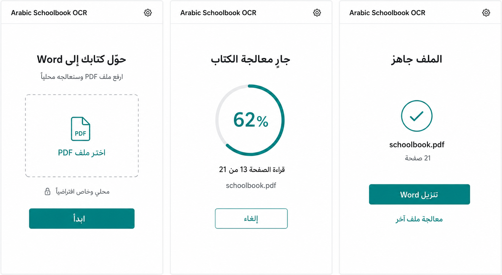
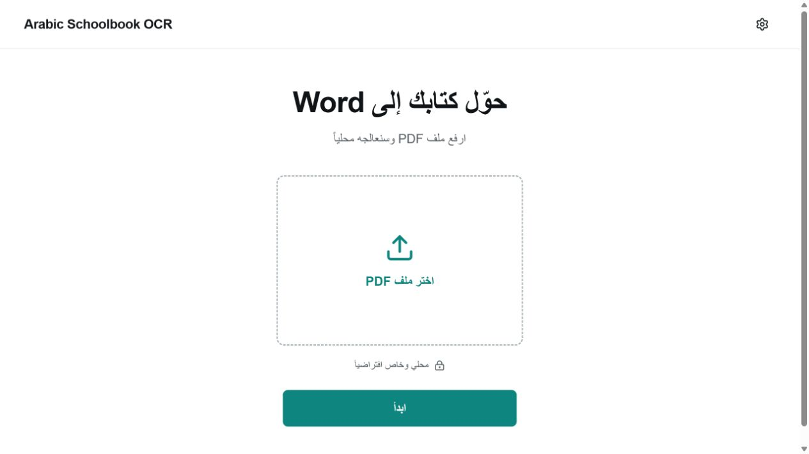
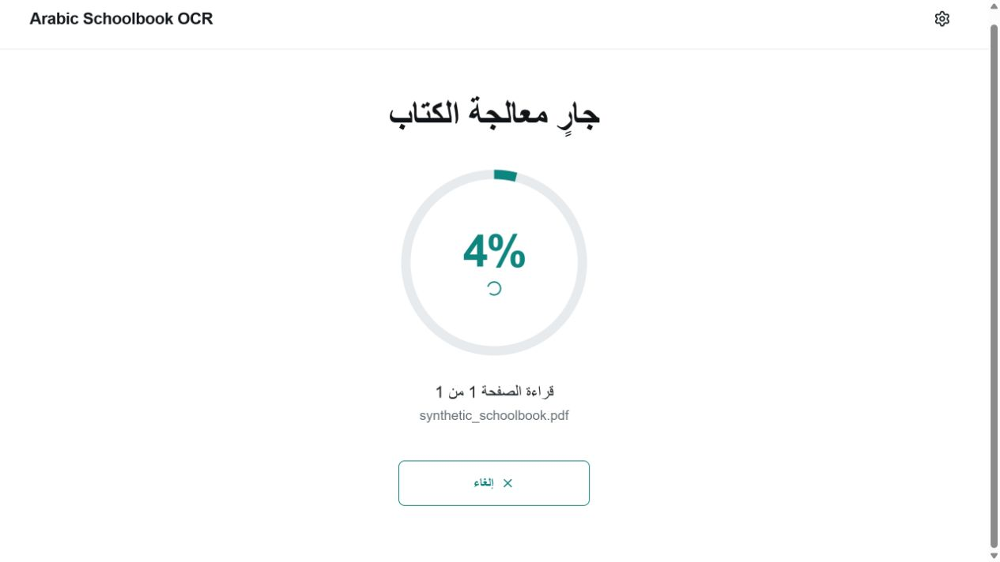
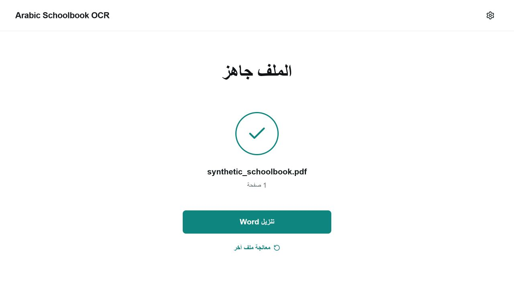
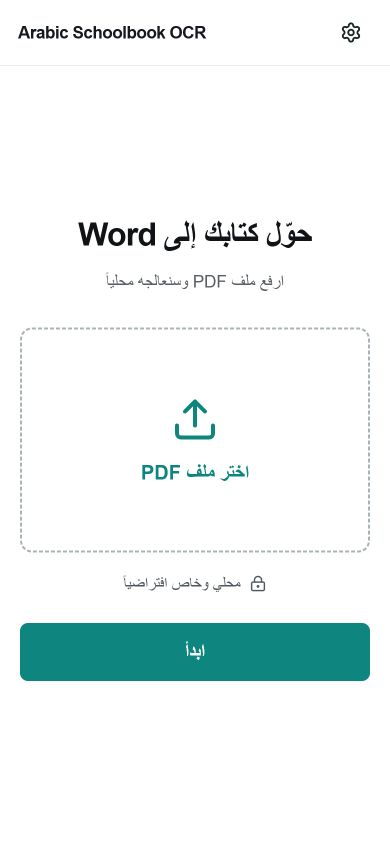
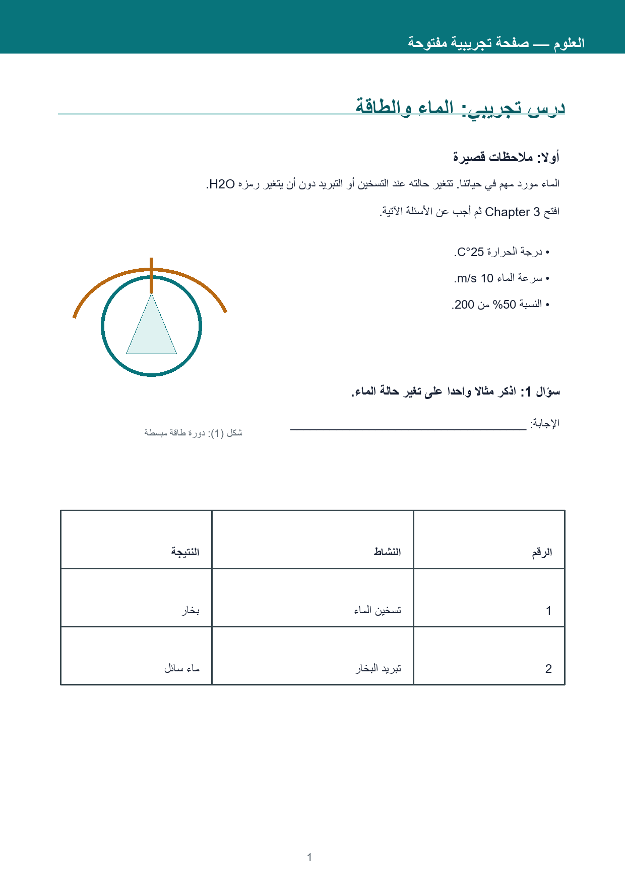
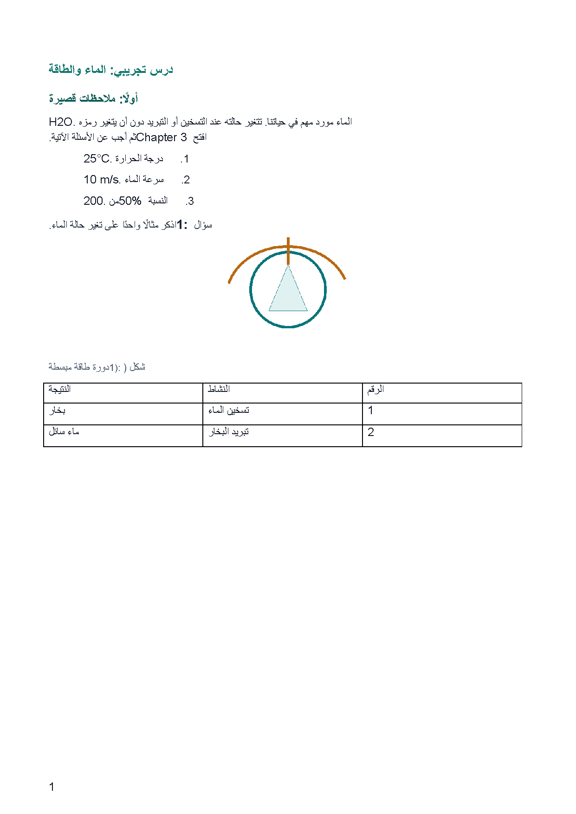

# Arabic Schoolbook OCR

Privacy-first Arabic PDF transcription into editable, semantic Word documents. The app combines local Arabic OCR, document-layout detection, right-to-left reading-order reconstruction, mixed Arabic-English runs, reviewable corrections, and real Word headings, lists, tables, figures, headers, footers, and page breaks.

> **v0.1.0-alpha:** the local pipeline and public synthetic demo run end to end, but this is not a production-accuracy release. CER/WER are blocked on human ground truth, the real-book formatting audit needs correction, and the optional Gemini pipeline has not been run on private pages.

## New: `mubsir/` — a measured, fully offline pipeline

The [`mubsir/`](mubsir/) directory adds a second, self-contained pipeline built
around the problem this repository has been blocked on: **accuracy you can
actually measure**. It ships its own gold set, so every number below is
reproducible with one command and none of it depends on a private book.

```bash
cd mubsir && ./setup.sh && python demo/run_demo.py
```

| Path | CER | WER | Paragraph F1 | Reading order |
|---|---|---|---|---|
| Born-digital text layer | exact | exact | **0.9995** | 1.000 |
| Repaired text layer | 0.905 word validity (clean prose = 0.870) | — | **0.9995** | 1.000 |
| Scanned, single column | **0.0145** | **0.041** | 0.932 | **1.000** |
| Scanned, two column | 0.080 | 0.136 | 0.842 | 0.998 |

Two findings drove it:

**An Arabic text layer can be wrong while looking right.** A real 209-page book
written in Word 2010 extracts as `ليربح التفػؽ كالسػـبة` where it renders as
`ليصبح التفوق والموهبة`. Every wrong character is still a valid Arabic letter,
so a character-class corruption check scores the page **0.0% corrupt** while it
is unreadable — only a dictionary sees it. The glyphs are fine and only their
Unicode labels are broken, so reading the raw glyph ids back through the
embedded font recovers the text exactly, with no OCR: **30% → 90% real Arabic
words**, 209 pages in 94 seconds.

**No single OCR engine is good at both halves of the job.** DBNet finds every
line including the short paragraph-final ones that carry the paragraph-break
signal; Tesseract reads Arabic about three times more accurately but silently
drops those same lines under every page-segmentation mode. Combining
DBNet detection with Tesseract recognition cut CER 4.8x, WER 7.5x and
hallucination 10x against the PP-OCR-only baseline.

Full method, the engine benchmark (including EasyOCR, rejected at 50 s/page),
and an explicit list of what still fails are in
[`mubsir/RESEARCH.md`](mubsir/RESEARCH.md).

`TRAINING_APPROVED=false`. This repository contains no training workflow, private book, external dataset payload, or fine-tuned weight.



The main interface is a single, distraction-free path: choose a PDF, watch real page progress, then download the polished Word document. Provider settings remain available from the gear without interrupting that path.

| Upload | Processing | Result |
|---|---|---|
|  |  |  |



The distributable fixture below is project-authored under CC0; it is not a page from the private acceptance book.



Rendered from the generated editable DOCX with local Microsoft Word:



## What it produces

- `<book>_literal.docx`: visible wording and digits preserved; uncertain content stays flagged.
- `<book>_polished.docx`: structural and Unicode cleanup only, with content changes gated by human approval.
- canonical logical-order JSON with boxes, block types, reading order, boundaries, and script runs;
- source/preprocessed pages, layout and reading-order overlays, provider evidence, disputed crops, and per-page checkpoints;
- correction, review, unresolved-issue, run-manifest, and accuracy-status reports;
- a locally rendered PDF when LibreOffice or a supported local Word converter is available.

Accuracy is deliberately reported as `UNMEASURED_PENDING_HUMAN_GROUND_TRUTH` until the private 30-page benchmark has been fully corrected and approved by a human.

## Operating modes

| Mode | OCR/layout path | Network behavior |
|---|---|---|
| Local | PaddleOCR Arabic PP-OCRv3 + PP-DocLayout-plus-L; Windows OCR verifier when available | Offline; default |
| Cloud Accurate | Azure Document Intelligence `prebuilt-layout` | Blocked without credentials and explicit per-job opt-in |
| AI Verified | Local Paddle + Windows evidence + Gemini on selected high-risk crops | Optional; blocked without an enabled capability, key, and crop-upload consent |
| Hybrid Verified | Azure primary + local verification + Gemini on disputed crops | Optional; blocked without both provider credentials and crop-upload consent |
| Maximum Accuracy | Azure + local evidence + crop verification + structural formatting + rendered-Word QA | Optional; full-page roles require separate selected-page consent |
| Unlimited research | Optional upstream/remote provider behind hardware preflight | Never blocks the main product; experimental |

The canonical schema and UI do not depend on a particular provider.

## Supported inputs and output structure

Input is a parseable PDF up to `MAX_UPLOAD_MB` (500 MB by default). The current focus is printed Modern Standard Arabic schoolbooks containing Arabic, embedded English, Western and Arabic-Indic digits, questions, answer choices, lists, basic tables, figures/captions, colored regions, and one- or two-column layouts.

Text is stored in Unicode logical order. Strings are never reversed. Word paragraphs receive RTL properties, Arabic runs receive RTL properties, Latin runs remain LTR, and tables are real editable Word tables.

## Install locally

Requirements: Python 3.10-3.13, Node.js 20+, pnpm, and roughly 8 GB RAM for CPU mode. PDFium is bundled as a rasterization fallback; Ghostscript or `pdftoppm` is used when installed. A CUDA-capable Paddle environment is optional; the tested Windows CPU stack is pinned because Paddle 3.3.x currently regresses on this workload.

```powershell
git clone https://github.com/dusk-futile/arabic-schoolbook-ocr.git
cd arabic-schoolbook-ocr
python -m venv .venv
.venv\Scripts\python -m pip install -U pip
.venv\Scripts\python -m pip install -e ".[local,dev]"
copy .env.example .env
cd web
pnpm install --frozen-lockfile
pnpm build
cd ..
.venv\Scripts\python -m uvicorn arabic_schoolbook_ocr.api:app --host 127.0.0.1 --port 8000
```

Open `http://127.0.0.1:8000`. Local mode needs no API key. On Linux/macOS, use `python -m venv`, `.venv/bin/python`, and `cp`; the Windows verifier is automatically omitted.

For Windows, the alpha ZIP contains a local installer and launcher:

```powershell
powershell -ExecutionPolicy Bypass -File .\install_windows.ps1
.\start_windows.bat
```

See [INSTALL_WINDOWS.md](INSTALL_WINDOWS.md). The launcher binds to `127.0.0.1`; it does not install a public service.

Container alternative (CPU Local mode, Poppler, LibreOffice, and persistent private/model volumes):

```bash
docker compose up --build
```

After the tagged workflow publishes successfully, the equivalent image is:

```bash
docker pull ghcr.io/dusk-futile/arabic-schoolbook-ocr:alpha
```

The published port is loopback-only by default. Docker was not installed on the audit workstation, so the image definition is validated by CI rather than claimed as a local build result.

The first Local job downloads only the selected Paddle model artifacts into the normal local model cache. See [MODEL_SUPPORT.md](MODEL_SUPPORT.md) for exact versions and revisions.

## Azure setup

Create `.env` from `.env.example` and set:

```dotenv
AZURE_DOCUMENT_INTELLIGENCE_ENDPOINT=https://<resource>.cognitiveservices.azure.com/
AZURE_DOCUMENT_INTELLIGENCE_KEY=<secret>
AZURE_DOCUMENT_INTELLIGENCE_PRICE_PER_1000_PAGES=<optional estimate>
```

Choose Cloud Accurate and acknowledge the privacy warning for that job. Credentials are never written to manifests or logs. No page is uploaded when `cloud_opt_in=false`.

## Gemini setup

```dotenv
GEMINI_API_KEY=<secret>
GEMINI_MODEL=<supported structured-output vision model>
ENABLE_GEMINI_VERIFICATION=false
ENABLE_GEMINI_FORMATTING=false
ENABLE_GEMINI_VISUAL_QA=false
GEMINI_INPUT_PRICE_PER_MILLION_TOKENS=<optional estimate>
GEMINI_OUTPUT_PRICE_PER_MILLION_TOKENS=<optional estimate>
```

The visual verifier sends only selected crops. The formatting and rendered-Word QA roles use selected full pages only after a second explicit confirmation. Gemini never edits the literal transcription; protected names, dates, digits, English, units, equations, question numbers, answer choices, and scientific terms remain reviewable. Keys entered in Settings live only in the server process and are never returned by the API.

## Command line

The installed CLI is checkpointed and private-local by default:

```powershell
arabic-schoolbook-ocr process book.pdf --mode local
arabic-schoolbook-ocr process book.pdf --mode windows --output-dir output\windows
arabic-schoolbook-ocr process book.pdf --mode ai-verified --ai-verification important --cloud-opt-in
arabic-schoolbook-ocr process book.pdf --mode maximum-accuracy --ai-verification every --cloud-opt-in --allow-full-page-gemini --full-book-confirmed
```

Cloud modes still require matching enabled capabilities and credentials. The confirmation flag does not replace provider/page consent; both are recorded in the run manifest. Omit export flags to create both literal and polished DOCX files.

## Reproduce tests and public fixtures

```powershell
.venv\Scripts\python -m ruff check .
.venv\Scripts\python -m mypy src
.venv\Scripts\python -m pytest
cd web
pnpm lint
pnpm build
cd ..
.venv\Scripts\python scripts\create_demo_fixture.py
```

Run the private five-page workflow only on material you are authorized to process:

```powershell
.venv\Scripts\python scripts\run_smoke.py <book.pdf> --mode local
```

Full-book command-line processing has a deliberate confirmation gate and resumes from page checkpoints:

```powershell
.venv\Scripts\python scripts\run_book.py <book.pdf> `
  --mode local --full-book-confirmed --job-id my-private-job
.venv\Scripts\python scripts\run_book.py <book.pdf> `
  --mode local --full-book-confirmed --job-id my-private-job --resume
```

All application inputs and derivatives live under ignored `jobs/` storage. Never move private pages into examples or documentation.

## Benchmark method

The locked private acceptance book is `EVALUATION_ONLY`: zero pages in train or validation. Thirty representative page numbers are fixed in `ground_truth.py`. OCR output can seed an unreviewed draft, but cannot become reference truth until a human corrects exact text, boxes, types, order, paragraph groups, boundary labels, runs, and table cells, then explicitly approves every page.

Once ready, evaluate modes separately for CER, WER, digits, English tokens, punctuation, heading F1, paragraph-boundary F1, reading order, tables, missing/hallucinated blocks, unresolved rate, latency, API usage, and cost. See [ACCURACY_REPORT.md](ACCURACY_REPORT.md), [BASELINE_RESULTS.md](BASELINE_RESULTS.md), [UNRESOLVED_BLOCK_ANALYSIS.md](UNRESOLVED_BLOCK_ANALYSIS.md), and [BOOK_LEVEL_SPLIT.md](BOOK_LEVEL_SPLIT.md).

The correction and page-approval procedure is documented in [GROUND_TRUTH.md](GROUND_TRUTH.md).

## Privacy and security

- Local is the default; cloud is fail-closed and consent is stored per job.
- Gemini capabilities are off by default; crop and full-page transfers have distinct consent scopes.
- Job files are served with `Cache-Control: no-store`, and paths are containment-checked.
- Upload size and PDF signatures are validated; secrets and private paths are ignored.
- Corrections require `human_approved=true`; literal text is never overwritten.

Read [PRIVACY.md](PRIVACY.md), [SECURITY.md](SECURITY.md), and [DATA_LICENSES.md](DATA_LICENSES.md) before processing sensitive or third-party material.

## Known limitations

Accuracy is not measured yet; local Arabic PP-OCRv3 is useful but not claimed to be the highest-accuracy path. The 10-page real-book formatting audit currently needs correction because reflow is top-compressed and source-relative spacing is not faithful. Complex formulas, nested tables, ornate layouts, handwriting, and damaged scans need human review. DOCX-to-PDF validation requires a local office renderer. Azure/Gemini benchmark results are absent until the user explicitly opts in to named runs. See [FORMATTING_AUDIT_SUMMARY.md](FORMATTING_AUDIT_SUMMARY.md), [AI_SMOKE_TEST_STATUS.md](AI_SMOKE_TEST_STATUS.md), and [KNOWN_LIMITATIONS.md](KNOWN_LIMITATIONS.md).

## Hardware and roadmap

- Tested local acceptance environment: Windows CPU, about 17 GB RAM, and NVIDIA GTX 1660 SUPER 6 GB used only for preflight; 209 source pages completed with no page failures.
- CPU Paddle is the supported default. GPU support depends on a compatible Paddle/CUDA installation.
- Unlimited-OCR was not run locally because its official BF16 recipe requires at least 8 GB VRAM.
- Next gates: human approval of all 30 benchmark pages; a consented five-page Gemini comparison; paired accuracy reporting; source-faithful page composition; then a production-readiness review.

## Licensing and citation

Repository code is Apache-2.0. The public demo assets are CC0. Third-party dependencies, data candidates, and model weights retain their own licenses; public availability is not permission for training or commercial use. See [THIRD_PARTY_NOTICES.md](THIRD_PARTY_NOTICES.md), [DATA_LICENSES.md](DATA_LICENSES.md), and [LICENSE_COMPATIBILITY_REPORT.md](LICENSE_COMPATIBILITY_REPORT.md).

Suggested software citation:

```text
Arabic Schoolbook OCR contributors (2026). Arabic Schoolbook OCR, version 0.1.0.
Privacy-first provider-based Arabic OCR and semantic DOCX reconstruction software.
```

Contributions are welcome under [CONTRIBUTING.md](CONTRIBUTING.md) and the [Code of Conduct](CODE_OF_CONDUCT.md). Do not submit private books, credentials, unlicensed datasets, or model weights.
