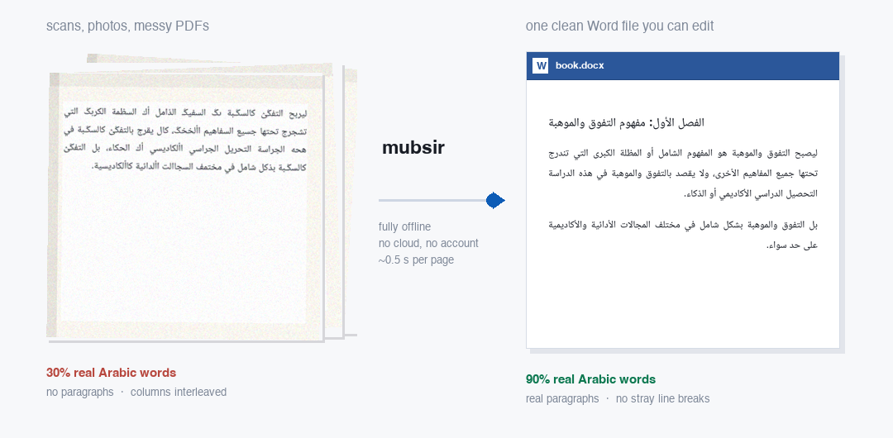

<div align="center">

# مُبصِر · mubsir

**Messy Arabic pages in. One clean Word file out.**



Fully offline · no cloud · no account · no admin rights · ~0.5 s per page

</div>

---

## What it does

You drop in a PDF, a scan, or photos of pages. You get back **one `.docx`** —
real Arabic, real paragraphs, right-to-left, with Heading / Normal / List
styles. You can open it in Word, edit it, save it, and hand it to whoever
embosses the Braille.

It also writes a plain-text version, a review PDF for proofreading, and a
report listing the few paragraphs worth a second look.

## Try it

```bash
cd mubsir
./setup.sh                 # setup.bat on Windows. One time. No admin needed.
python demo/run_demo.py    # prints accuracy against known ground truth
```

Then your own file:

```bash
python -m mubsir book.pdf -o output      # → output/book.docx
python -m mubsir.webui                   # or a browser page, drag a file in
```

---

## The thing that is actually new here

**An Arabic PDF's text layer can be wrong while looking completely fine, and
nobody checks for it.**

The sample book — 209 pages, written in Microsoft Word 2010 — renders perfectly
on screen. Copy the text out and you get this:

```
what you see    ليصبح التفوق والموهبة هو المفهوم الشامل
what you get    ليربح التفػؽ كالسػـبة ىػ السفيػـ الذامل
```

Every wrong character is **still a valid Arabic letter**. So the usual "is this
text corrupt?" test — are there strange symbols? — scores this page **0.0%
corrupt** while it is completely unreadable. Only a dictionary catches it.

The glyphs were never wrong; only their Unicode labels were. So mubsir reads
the raw glyph IDs back through the font embedded in the PDF and reconstructs
the real characters — **exactly, with no OCR at all**:

| | real Arabic words |
|---|---|
| opening the PDF and copying the text | **30%** |
| after mubsir's font repair | **88%** |
| after its dictionary pass | **90%** |
| *clean Arabic prose, same dictionary* | *87%* |

209 pages in **94 seconds**. As far as I can find, no other Arabic OCR tool
checks whether a text layer is lying to it, and this failure is common in books
produced with Arabic Word templates.

Two smaller ideas that also seem to be new:

- **Two OCR engines, each covering the other's blind spot.** DBNet finds every
  line, including the short last line of a paragraph — which is the single
  strongest clue that a paragraph ended. Tesseract reads Arabic about three
  times more accurately but silently *drops* those short lines, under every one
  of its page-segmentation modes. Neither alone is enough. Together: **CER 4.8×
  better, WER 7.5× better** than either approach on its own.
- **The space/return guarantee is enforced, not hoped for.** See below.

---

## Spacing and returns

For a Braille embosser a **space** and a **paragraph mark** are different
instructions. A space is a cell; a paragraph mark ends a block; a stray line
break inside a paragraph becomes a hard line ending the reader cannot tell from
a real one. This is the most fragile thing in the whole chain, so it is
guaranteed by construction rather than checked afterwards:

- a newline inside a paragraph → **one space** (it was a soft wrap all along)
- tabs → one space; runs of spaces → one space
- no-break / thin / hair / figure / line-separator spaces → **a plain space**
  (each is a real cell to an embosser)
- zero-width and bidi control characters → **deleted** (stray cells, or they
  silently reorder the line)
- leading and trailing spaces stripped

**The file contains no manual line breaks at all** — Word does the wrapping.
Audit any finished file yourself:

```bash
python eval/audit_docx.py output/book.docx
```

```
[ ok ] hard_line_breaks           0
[ ok ] newline_inside_paragraph   0
[ ok ] tab_runs                   0
[ ok ] double_space               0
[ ok ] leading_or_trailing_space  0
VERDICT: clean for embossing
```

---

## Does it use AI?

**Not for the text.** Nothing generative touches a single word, so it cannot
invent one. Every character comes from either the PDF's own font or the OCR
engine.

There *is* machine learning, in one narrow place: deciding whether a line break
is a soft wrap or a real paragraph. Rules handle every boundary they are
confident about; a trained classifier breaks the ties.

I tried a local language model for this first, and it did not work:

| | size | per decision | held-out accuracy |
|---|---|---|---|
| local LLM (`qwen2.5:1.5b`) | 986 MB | 1.6 s | **chance** |
| local LLM (`qwen2.5vl:3b`) | 3.2 GB | 4.6 s | **chance** |
| **the classifier that shipped** | **1.1 KB** | **microseconds** | **0.991** |

Both language models answered *the same word to every question* — `NEW` to all
of them in English, `نعم` to all of them in Arabic. They followed the framing
of the question rather than the evidence, because the evidence is geometric:
how much of the column the previous line filled, how big the vertical gap is. A
language model handed two snippets of text cannot see that. On one test it
overrode two correct answers with wrong ones.

So the "small local AI" here is 1.1 KB of logistic-regression weights over
eleven geometric features, trained on 3,379 labelled boundaries and validated
**leave-one-style-out**. Used as a tiebreaker on scanned pages it lifts
paragraph accuracy **0.9143 → 0.9399**, and no layout got worse. You can read
its weights in `models/boundary_lr.json` and argue with them.

---

## How heavy is it, and where does it run?

Built for the machines the work actually happens on: **old Windows PCs, 8 GB
RAM, no graphics card, no admin rights.** All numbers below are from an Intel
i3-8100 with 8 GB and no GPU.

| | |
|---|---|
| Install | ~350 MB dependencies + ~40 MB models |
| Memory while running | under 1 GB |
| Graphics card | not used |
| Network | only once, during setup |
| Born-digital page | **~0.45 s** |
| Scanned page (full OCR) | **~4.7 s** |
| A 209-page book | **94 seconds** |
| A 300-page scanned book | ~25 minutes, unattended |

No admin rights are needed anywhere: Python, Tesseract and the models all
install inside the user's own home folder.

---

## Accuracy

Every number is reproducible from this repository — `demo/run_demo.py` measures
them against ground truth that ships with it.

| Input | Characters wrong | Words wrong | Paragraphs right | Reading order |
|---|---|---|---|---|
| PDF with a good text layer | 0% | 0% | **99.95%** | **100%** |
| PDF with a broken text layer | ~10% of words | — | **99.95%** | **100%** |
| Scanned page, single column | **1.5%** | **4.1%** | 93.2% | **100%** |
| Scanned page, two columns | 8.0% | 13.6% | 87.8% | 99.8% |

Put plainly: on a scanned page **about 99 characters in 100 are right, and 96
words in 100 are exactly right**. On a book that already has a text layer —
which the sample book did — the text is exact and the work is all structure.

### Against the alternatives

Same pages, same machine, measured not quoted:

| Tool | Characters wrong | Words wrong | Seconds per page |
|---|---|---|---|
| Just copying text out of the PDF | ~70% of words | — | instant |
| EasyOCR (Arabic) | 42.6% | 61.7% | **50.0** |
| PaddleOCR PP-OCRv4 (Arabic) | 6.9% | 30.8% | 3.9 |
| Tesseract 5 alone | 4.5% | 10.4% | 2.0 |
| **mubsir** | **1.5%** | **4.1%** | 4.7 |

EasyOCR is rejected on all three counts — its right-to-left line ordering comes
out scrambled and it is 25× over the time budget for this hardware. Mistral's
Arabic OCR was not benchmarked: it is a cloud API, and this has to work with no
network and no account.

### Where it still fails

Said plainly, because you will hit these:

- **Two-column scans are the weak spot.** 8% of characters wrong against 1.5%
  for single column. About 9% of lines are lost in recognition on those pages.
- **Paragraph accuracy on scans is 93%, not the 99% target.** It hits 99.95% on
  pages that have a text layer.
- **Four glyphs in the sample book were refused, not guessed.** They were
  ي/ى-type ambiguities the dictionary genuinely could not settle, and a wrong
  guess is a misspelling a blind reader cannot detect. They keep their original
  value and are flagged for review.
- **Handwriting is not supported.** Printed text only.

---

## What you get for each file

| File | For |
|---|---|
| `book.docx` | **the main output** — edit it in Word, hand it on for embossing |
| `book.txt` | plain text, one paragraph per block, blank line between |
| `book.review.pdf` | proofreading: numbered paragraphs, source page refs, doubts shaded |
| `book.review.html` | the few paragraphs worth checking, ranked by risk |

Uncertain paragraphs are **highlighted yellow** in the Word file. The point is
not to be perfect — it is to make the human review fast and targeted.

---

## How it works

```
PDF, scans or photos
  │
  ├─ 1. Is the text layer trustworthy?
  │     Not "does one exist" — a broken Arabic font maps every letter to a
  │     different valid Arabic letter, so the text looks fine and reads as
  │     nonsense. The test is: are these real words?
  │        trustworthy  →  use it
  │        broken       →  rebuild it from the embedded font (exact, no OCR)
  │        no text      →  OCR: DBNet finds the lines, Tesseract reads them
  │
  ├─ 2. Repair the lines
  │     Extractors split one visual line at every direction change, so Arabic
  │     containing an English word arrives in three pieces. Regroup by baseline,
  │     re-order right-to-left, never merge across a column gutter.
  │
  ├─ 3. Rebuild the paragraphs        ← the part that matters
  │     For every line break: soft wrap or real paragraph? Rules decide what
  │     they are sure of; the 1.1 KB classifier breaks the ties.
  │
  ├─ 4. Clean the text
  │     Arabic letter forms, tatweel, Arabic vs Latin punctuation, digits,
  │     dictionary check for OCR slips. Never changes a word into another word.
  │
  └─ 5. Write it out, whitespace-safe
```

## Reproduce everything

```bash
python demo/run_demo.py            # accuracy on the bundled demo pages
python -m pytest tests/ -q         # 26 tests, including whitespace guarantees
python eval/run_eval.py            # paragraph accuracy, text-layer path
python eval/run_eval_ocr.py        # scanned path: CER / WER / order
python eval/train_boundary.py      # retrain the classifier, leave-one-style-out
```

Full method, every benchmark, and an explicit list of what fails:
**[RESEARCH.md](RESEARCH.md)**.

## Licence

Contributed under this repository's **Apache-2.0** licence. Bundled components
keep their own: PP-OCRv4 Arabic and RapidOCR detection models (Apache-2.0),
Tesseract (Apache-2.0), the Arabic wordlist derived from LibreOffice's hunspell
dictionary (GPL/LGPL/MPL), and an English wordlist from Webster's 1934 (public
domain). See `models/lexicon/SOURCE.md`. The wordlists are optional — delete
them and the tool still runs, minus the dictionary pass.
